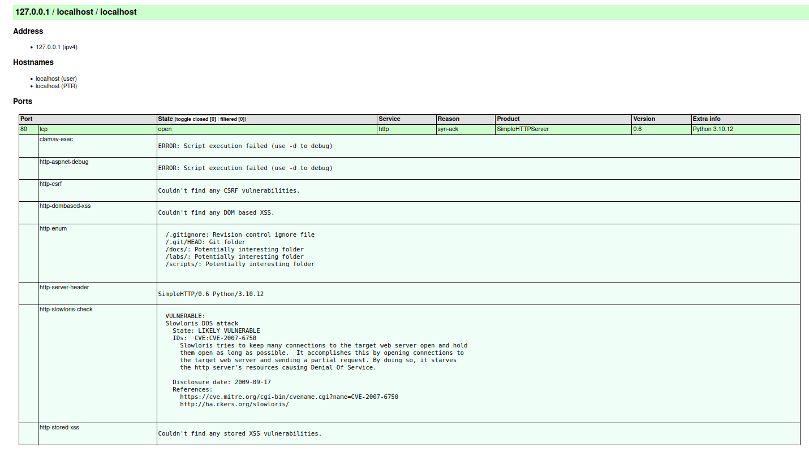

<div align="center">
<h1><a id="intro">Лабораторная работа №3</a><br></h1>
<a href="https://docs.github.com/en"></a>
<a href="https://daringfireball.net/projects/markdown"></a> 
<a href="https://symbl.cc/en/unicode-table"></a> 
<a href="https://shields.io"></a>
<a href="https://img.shields.io/badge/Risk_Analyze-2448a2"></a> </a> </a></div>


## Материал

**Nmap Network Mapper** `open-source` утилита для исследования и анализа сетей, в которой основная цель выявление активных устройств, открытых портов, сервисов, версий ПО, ОС и других характеристик, которые способствуют определнию вектора атаки и влияния, а также перехвата управления инфраструктурой или отслеживания. Фактически она рассматривается как виртуальная сетевая карта

- **Методы:**
    - TCP - connect, 
    - TCP SYN - stealth-сканирование, 
    - UDP 
    - FIN 
    - ACK 
    - Xmas tree 
    - NULL-сканирование
    -  ICMP ping
    -  FTP-proxy 
    -  idle scan - невидимое сканирование
    -  и т.д.
- **Возможности:**
    - Определение ОС удалённых хостов с помощью отпечатков TCP/IP-стеков - OS fingerprinting
    - Определение версий сервисов на открытых портах
    - Сканирование сетей с динамическим управлением временем отправки пакетов
    - Выявление пакетных фильтров, межсетевых экранов,маршрутизации и IP-фрагментации
    - Nmap Scripting Engine позволяет автоматизировать поиск уязвимостей SQL Injection и т.д.
    - Может избегать обнаружения, используя ложные хосты и изменение поведения сканера, и т.д.
    - Может сканировать диапазон IP-адресов и множества целей
    - Помогает определить, что открытый порт указывает на то, что служба запущена и ожидает соединений

- **Команды**

```bash
$ nmap -iL targets.txt # множествнные цели сканирований
     -sL # List Scan 
     -sn # Ping Scan 
     -Pn # all hosts online
     -PS/PA/PU/PY[portlist] # TCP SYN/ACK, UDP or SCTP
     -PE/PP/PM # ICMP echo, timestamp, netmask request
     -PO[protocol list] # IP Protocol Ping
     -n/-R # Не для DNS resolution
     --dns-servers <serv1[,serv2],...> # custom DNS
     --system-dns # Используйте OS
     --traceroute 
```

-  **Типы сканирований и опции nmap**

<table>
  <thead>
    <tr>
      <th>Scan type</th>
      <th>nmap option</th>
    </tr>
  </thead>
  <tbody>
    <tr><td>TCP (connect)</td><td>-sT</td></tr>
    <tr><td>TCP SYN</td><td>-sS</td></tr>
    <tr><td>TCP NULL</td><td>-sN</td></tr>
    <tr><td>TCP FIN</td><td>-sF</td></tr>
    <tr><td>TCP XMAS</td><td>-sX</td></tr>
    <tr><td>TCP idle (zombie)</td><td>-sI</td></tr>
    <tr><td>UDP</td><td>-sU</td></tr>
    <tr><td>OS</td><td>-A</td></tr>
  </tbody>
</table>

- **Порты**

<table>
  <thead>
    <tr>
      <th>Port</th>
      <th>Service</th>
      <th>Protocol</th>
    </tr>
  </thead>
  <tbody>
    <tr><td>20/21</td><td>FTP (File Transfer)</td><td>TCP</td></tr>
    <tr><td>22</td><td>SSH (Secure Shell)</td><td>TCP</td></tr>
    <tr><td>23</td><td>Telnet</td><td>TCP</td></tr>
    <tr><td>25</td><td>SMTP (Simple Mail Transfer)</td><td>TCP</td></tr>
    <tr><td>53</td><td>DNS (Domain Name System)</td><td>TCP/UDP</td></tr>
    <tr><td>67/68</td><td>DHCP (Dynamic Host Configuration Protocol)</td><td>UDP</td></tr>
    <tr><td>69</td><td>TFTP (Trivial File Transfer Protocol)</td><td>UDP</td></tr>
    <tr><td>80</td><td>HTTP (Hypertext Transfer Protocol)</td><td>TCP</td></tr>
    <tr><td>110</td><td>POP3 (Post Office Protocol version 3)</td><td>TCP</td></tr>
    <tr><td>443</td><td>HTTPS (HTTP Secure)</td><td>TCP</td></tr>
    <tr><td>3306</td><td>MySQL Database</td><td>TCP</td></tr>
  </tbody>
</table>


***

## Задание

- [x] 1. Опишите используемые методы по их назначению, как они функционируют и какие результаты могут дать для оценки. Используйте сноску из материалов выше по флагам команд.

<table>
    <thead>
        <tr>
            <th>Тип</th>
            <th>Флаг</th>
            <th>Описание</th>
            <th>Применение</th>
            <th>Недостатки</th>
        </tr>
    </thead>
    <tbody>
        <tr>
            <td>TCP Connect</td>
            <td><code>-sT</code></td>
            <td>Полное TCP-соединение</td>
            <td>Надёжное определение открытых портов, когда нет root-прав. Сканирование IPv6</td>
            <td>Не скрытный</td>
        </tr>
        <tr>
            <td>TCP SYN</td>
            <td><code>-sS</code></td>
            <td>SYN → SYN/ACK → RST</td>
            <td>Быстрое и скрытное сканирование TCP-портов</td>
            <td>Требует root-прав</td>
        </tr>
        <tr>
            <td>TCP NULL</td>
            <td><code>-sN</code></td>
            <td>Пакет без флагов</td>
            <td>Скрытное сканирование, обход простых FW/IDS</td>
            <td>Большинство FW уже подстроились</td>
        </tr>
        <tr>
            <td>TCP FIN</td>
            <td><code>-sF</code></td>
            <td>Пакет с флагом FIN</td>
            <td>Скрытное сканирование, обход простых FW/IDS</td>
            <td>Большинство FW уже подстроились</td>
        </tr>
        <tr>
            <td>TCP XMAS</td>
            <td><code>-sX</code></td>
            <td>Пакет с флагами FIN + PSH + URG</td>
            <td>Скрытное сканирование, обход простых FW/IDS</td>
            <td>Большинство FW уже подстроились</td>
        </tr>
        <tr>
            <td>TCP Idle</td>
            <td><code>-sI</code></td>
            <td>Сканирование через zombie-хост</td>
            <td>Полностью скрытный</td>
            <td>Медленный, сложный, не факт что заработает</td>
        </tr>
        <tr>
            <td>UDP</td>
            <td><code>-sU</code></td>
            <td>Сканирование UDP портов</td>
            <td>Отправляет UDP-пакеты</td>
            <td>Медленный</td>
        </tr>
        <tr>
            <td>Aggressive</td>
            <td><code>-A</code></td>
            <td>Включает OS Detection (-O), Version detection (-sV), script scanning (-sC), traceroute</td>
            <td>Комплексное сканирование</td>
            <td>Очень заметный</td>
        </tr>
    </tbody>
</table>

- [ ] 2. Выведите на терминале и проанализируйте следующие команды консоли

***
Сканироване резервированных портов
```bash
$ nmap localhost

Starting Nmap 7.80 ( https://nmap.org ) at 2025-12-22 23:15 MSK
Nmap scan report for localhost (127.0.0.1)
Host is up (0.00020s latency).
Not shown: 998 closed ports
PORT    STATE SERVICE
22/tcp  open  ssh
631/tcp open  ipp

Nmap done: 1 IP address (1 host up) scanned in 0.07 seconds

```
***
Сканирование с использование NSE-скриптов
```bash
$ nmap -sC localhost

Starting Nmap 7.80 ( https://nmap.org ) at 2025-12-22 23:16 MSK
Nmap scan report for localhost (127.0.0.1)
Host is up (0.000059s latency).
Not shown: 998 closed ports
PORT    STATE SERVICE
22/tcp  open  ssh
631/tcp open  ipp
| http-robots.txt: 1 disallowed entry 
|_/
|_http-title: Home - CUPS 2.4.1

Nmap done: 1 IP address (1 host up) scanned in 0.75 seconds
```
Открыты 2 порта:
- 22/tcp — SSH-сервер (для удалённого доступа к терминалу).
- 631/tcp — сервис IPP (Internet Printing Protocol), это CUPS (Common Unix Printing System) — система печати в Linux/macOS.

Для порта 631 Nmap дополнительно проверил веб-интерфейс CUPS:
- Найден файл robots.txt с одной запрещённой директорией (/).
- Заголовок страницы — "Home - CUPS 2.4.1", то есть это веб-интерфейс управления принтерами на http://localhost:631.

***
Сканирование с определением ОС
```bash
$ nmap -O localhost

Starting Nmap 7.80 ( https://nmap.org ) at 2025-12-22 23:21 MSK
Nmap scan report for localhost (127.0.0.1)
Host is up (0.00011s latency).
Not shown: 998 closed ports
PORT    STATE SERVICE
22/tcp  open  ssh
631/tcp open  ipp
Device type: general purpose
Running: Linux 2.6.X
OS CPE: cpe:/o:linux:linux_kernel:2.6.32
OS details: Linux 2.6.32
Network Distance: 0 hops

OS detection performed. Please report any incorrect results at https://nmap.org/submit/ .
Nmap done: 1 IP address (1 host up) scanned in 2.30 seconds
```

- Device type: general purpose (обычный компьютер/сервер).
- Running: Linux 2.6.X (ядро Linux версии 2.6.x).
- OS details: Linux 2.6.32 (конкретно определена версия ядра 2.6.32)
***
Сканирование заданных портов
```bash
$ nmap -p 80 localhost
$ nmap -p 443 localhost
$ nmap -p 8443 localhost

Starting Nmap 7.80 ( https://nmap.org ) at 2025-12-22 23:26 MSK
Nmap scan report for localhost (127.0.0.1)
Host is up (0.00051s latency).

PORT     STATE  SERVICE
80/tcp   open   http
443/tcp  closed https
8443/tcp closed https-alt

Nmap done: 1 IP address (1 host up) scanned in 0.02 seconds
```
Открыт только 80 (открыл по ходу лабы через `python -m http.server 80`)

***

Сканирование 65535 портов
```bash
$ nmap -p "*" localhost

Starting Nmap 7.80 ( https://nmap.org ) at 2025-12-22 23:28 MSK
Nmap scan report for localhost (127.0.0.1)
Host is up (0.000087s latency).
Not shown: 8316 closed ports
PORT     STATE SERVICE
22/tcp   open  ssh
80/tcp   open  http
631/tcp  open  ipp
3462/tcp open  track

Nmap done: 1 IP address (1 host up) scanned in 0.14 seconds
```

- 22/tcp — SSH-сервер (удалённый доступ).
- 80/tcp — HTTP-сервер (веб-сервер, вероятно, Apache/Nginx или что-то запущенное локально для разработки/лаб).
- 631/tcp — IPP (CUPS, система печати, веб-интерфейс на http://localhost:631).
- 3462/tcp

***
Сканирование с определением версии
```bash
$ nmap -sV -p 22,80 localhost

Starting Nmap 7.80 ( https://nmap.org ) at 2025-12-22 23:31 MSK
Nmap scan report for localhost (127.0.0.1)
Host is up (0.00017s latency).

PORT   STATE SERVICE VERSION
22/tcp open  ssh     OpenSSH 8.9p1 Ubuntu 3ubuntu0.13 (Ubuntu Linux; protocol 2.0)
80/tcp open  http    SimpleHTTPServer 0.6 (Python 3.10.12)
Service Info: OS: Linux; CPE: cpe:/o:linux:linux_kernel

Service detection performed. Please report any incorrect results at https://nmap.org/submit/ .
Nmap done: 1 IP address (1 host up) scanned in 6.37 seconds
```

***
ping сканирование подсети
```bash
$ nmap -sP 10.0.2.0/24
Starting Nmap 7.80 ( https://nmap.org ) at 2025-12-22 23:32 MSK
Nmap scan report for production (10.0.2.15)
Host is up (0.00040s latency).
Nmap scan report for production (10.0.2.30)
Host is up (0.0011s latency).
Nmap done: 256 IP addresses (2 hosts up) scanned in 4.18 seconds
```
Живые хосты
- 10.0.2.15
- 10.0.2.30

***
Шлюз - 10.0.2.2, хотя nmap не может до него достучаться
```bash
$ ip route show | grep default
default via 10.0.2.2 dev enp0s3 proto dhcp src 10.0.2.15 metric 100 

$ nmap --open 10.0.2.2
Starting Nmap 7.80 ( https://nmap.org ) at 2025-12-22 23:36 MSK
Note: Host seems down. If it is really up, but blocking our ping probes, try -Pn
Nmap done: 1 IP address (0 hosts up) scanned in 3.28 seconds

$ ping 10.0.2.2
PING 10.0.2.2 (10.0.2.2) 56(84) bytes of data.
64 bytes from 10.0.2.2: icmp_seq=1 ttl=64 time=0.975 ms
64 bytes from 10.0.2.2: icmp_seq=2 ttl=64 time=0.385 ms
```
***
показывает в реальном времени все отправляемые и получаемые сетевые пакеты, соединения и низкоуровневые события
```bash
$ nmap --packet-trace scanme.nmap.org

Starting Nmap 7.80 ( https://nmap.org ) at 2025-12-22 23:39 MSK
CONN (0.1335s) TCP localhost > 45.33.32.156:80 => Operation now in progress
CONN (0.1340s) TCP localhost > 45.33.32.156:443 => Operation now in progress
CONN (0.3251s) TCP localhost > 45.33.32.156:80 => Connected
NSOCK INFO [0.3260s] nsock_iod_new2(): nsock_iod_new (IOD #1)
NSOCK INFO [0.3260s] nsock_connect_udp(): UDP connection requested to 127.0.0.53:53 (IOD #1) EID 8
NSOCK INFO [0.3260s] nsock_read(): Read request from IOD #1 [127.0.0.53:53] (timeout: -1ms) EID 18
NSOCK INFO [0.3260s] nsock_write(): Write request for 43 bytes to IOD #1 EID 27 [127.0.0.53:53]
NSOCK INFO [0.3260s] nsock_trace_handler_callback(): Callback: CONNECT SUCCESS for EID 8 [127.0.0.53:53]
NSOCK INFO [0.3260s] nsock_trace_handler_callback(): Callback: WRITE SUCCESS for EID 27 [127.0.0.53:53]
NSOCK INFO [0.3880s] nsock_trace_handler_callback(): Callback: READ SUCCESS for EID 18 [127.0.0.53:53] (72 bytes): l............156.32.33.45.in-addr.arpa..............,...scanme.nmap.org.
NSOCK INFO [0.3880s] nsock_read(): Read request from IOD #1 [127.0.0.53:53] (timeout: -1ms) EID 34
NSOCK INFO [0.3880s] nsock_iod_delete(): nsock_iod_delete (IOD #1)
NSOCK INFO [0.3880s] nevent_delete(): nevent_delete on event #34 (type READ)
CONN (0.3880s) TCP localhost > 45.33.32.156:5900 => Operation now in progress

...

CONN (13.5911s) TCP localhost > 45.33.32.156:80 => Connected
Nmap scan report for scanme.nmap.org (45.33.32.156)
Host is up (0.19s latency).
Other addresses for scanme.nmap.org (not scanned): 2600:3c01::f03c:91ff:fe18:bb2f
Not shown: 996 filtered ports
PORT      STATE SERVICE
22/tcp    open  ssh
80/tcp    open  http
9929/tcp  open  nping-echo
31337/tcp open  Elite
```

**CONN (0.1335s) … :80 => Operation now in progress**

- Nmap начал устанавливать TCP-соединение с портом 80 (HTTP) на IP scanme.nmap.org (45.33.32.156).

**CONN (0.3251s) … :80 => Connected**

- Соединение с портом 80 успешно установлено.

- **NSOCK INFO** — это низкоуровневые события сетевого движка Nmap:
  - Nmap создал новый I/O-дескриптор (IOD #1).
  - Отправил UDP-запрос на локальный DNS-резолвер
  - Запросил обратное (PTR) и прямое разрешение имени для IP 45.33.32.156.
  - Получил ответ (72 байта), в котором подтвердилось имя scanme.nmap.org.
  - Закрыл соединение с DNS.

**CONN (0.3880s) … :5900 и позже другие порты**

- Nmap продолжил проверку других популярных портов (5900 — часто VNC, и т.д.).

***
Показ сетевых интерфейсов и таблицы маршрутизации
```bash
$ nmap --iflist

Starting Nmap 7.80 ( https://nmap.org ) at 2025-12-22 23:47 MSK
************************INTERFACES************************
DEV     (SHORT)   IP/MASK                     TYPE     UP MTU   MAC
lo      (lo)      127.0.0.1/8                 loopback up 65536
lo      (lo)      ::1/128                     loopback up 65536
enp0s3  (enp0s3)  10.0.2.15/24                ethernet up 1500  08:00:27:D9:43:0F
enp0s3  (enp0s3)  fe80::a00:27ff:fed9:430f/64 ethernet up 1500  08:00:27:D9:43:0F
enp0s8  (enp0s8)  10.0.2.30/24                ethernet up 1500  08:00:27:21:8A:A8
enp0s8  (enp0s8)  fe80::a00:27ff:fe21:8aa8/64 ethernet up 1500  08:00:27:21:8A:A8
enp0s9  (enp0s9)  10.0.3.30/24                ethernet up 1500  08:00:27:D6:66:23
enp0s9  (enp0s9)  fe80::a00:27ff:fed6:6623/64 ethernet up 1500  08:00:27:D6:66:23
docker0 (docker0) 172.17.0.1/16               ethernet up 1500  96:48:80:B6:E4:52

**************************ROUTES**************************
DST/MASK                     DEV     METRIC GATEWAY
8.8.4.4/32                   enp0s3  100    10.0.2.2
8.8.8.8/32                   enp0s3  100    10.0.2.2
10.0.2.2/32                  enp0s3  100
192.168.10.1/32              enp0s3  100    10.0.2.2
10.0.2.0/24                  enp0s8  0
10.0.3.0/24                  enp0s9  0
10.0.2.0/24                  enp0s3  100
172.17.0.0/16                docker0 0
0.0.0.0/0                    enp0s3  100    10.0.2.2
::1/128                      lo      0
fe80::a00:27ff:fe21:8aa8/128 enp0s8  0
fe80::a00:27ff:fed6:6623/128 enp0s9  0
fe80::a00:27ff:fed9:430f/128 enp0s3  0
::1/128                      lo      256
fe80::/64                    enp0s9  256
fe80::/64                    enp0s8  256
fe80::/64                    enp0s3  256
ff00::/8                     enp0s9  256
ff00::/8                     enp0s8  256
ff00::/8                     enp0s3  256
```
***
ACK-сканирование
- Если приходит RST-пакет в ответ → порт unfiltered
- Если ничего не приходит (или приходит ICMP unreachable) → порт filtered
```bash
$ nmap -sA scanme.nmap.org

Starting Nmap 7.80 ( https://nmap.org ) at 2025-12-22 23:52 MSK
Nmap scan report for scanme.nmap.org (45.33.32.156)
Host is up (0.00030s latency).
Other addresses for scanme.nmap.org (not scanned): 2600:3c01::f03c:91ff:fe18:bb2f
All 1000 scanned ports on scanme.nmap.org (45.33.32.156) are unfiltered

Nmap done: 1 IP address (1 host up) scanned in 0.27 seconds
```
***
SYN-сканирование без проверки живости порта
```bash
$ nmap -PN scanme.nmap.org 

Starting Nmap 7.80 ( https://nmap.org ) at 2025-12-22 23:52 MSK
Nmap scan report for scanme.nmap.org (45.33.32.156)
Host is up (0.19s latency).
Other addresses for scanme.nmap.org (not scanned): 2600:3c01::f03c:91ff:fe18:bb2f
Not shown: 996 filtered ports
PORT      STATE SERVICE
22/tcp    open  ssh
80/tcp    open  http
9929/tcp  open  nping-echo
31337/tcp open  Elite
```
***
Сканирование с:
- Определением версии сервисов
- Применении скриптов vuln (проверка известных уязвимостей)
- Сохранением в файл
```bash
$ nmap -sV --script vuln -oN nmapres_new.txt localhost
```
***
Сканировние http порта с python-сервером
```bash
$ mkdir -p ~/project/reports
$ nmap -sV -p 80 --script vuln -oN ~/project/reports/nmapres_new.txt -oX ~/project/reports/nmapres_new.xml localhost
$ xsltproc ~/project/reports/nmapres_new.xml -o ~/project/reports/nmapres_new.html
```
Краткий вывод
```
|   VULNERABLE:
|     State: LIKELY VULNERABLE
```

Полученный анализ .html

***

Список файлов:
- nmapres.txt - анализ 80 порта с скриптами vuln
- nmapres.html - Удобочитаемый nmapres.txt
- nmapres_new.txt - анализ портов на localhost с определением ОС и скриптами vuln
- exmp_targets.txt

## Links

- [Markdown](https://stackedit.io)
- [GitHub CLI](https://cli.github.com)
- [Gist](https://gist.github.com)
- [IANA](https://www.iana.org)
- [IANA Port Numbers](https://www.iana.org/assignments/service-names-port-numbers/service-names-port-numbers.xhtml)
- [Nmap GitHub](https://github.com/nmap/nmap)
- [Официальная документация nmap](https://nmap.org/book/)
- [Nmap Reference Guide](https://nmap.org/book/man.html)
- [Nmap Script (NSE) Reference](https://nmap.org/nsedoc/)
- [Nmap Tutorial (Hackers-Arise)](https://nmap.org/docs.html)
- [OWASP Testing Guide – Network Scanning](https://owasp.org/www-project-web-security-testing-guide/)

Copyright (c) 2025 Elijah S Shmakov

